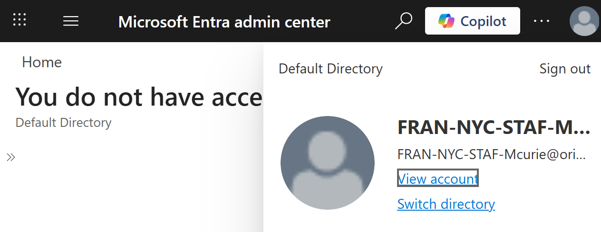
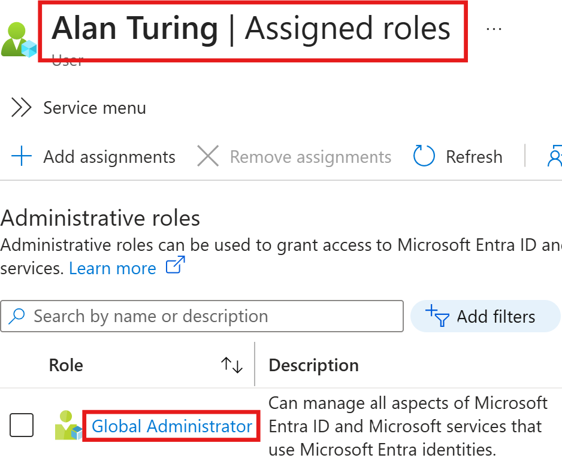

# Enterprise Identity Governance & Identity Lifecycle Management (ILM)

## Executive Summary
To establish a "Source of Truth" for the NYC Education Franchise, I initialized a centralized identity directory using Microsoft Entra ID. Rather than manual entry, I utilized a Flat-File Ingestion (CSV) methodology to ensure data integrity, scalability, and adherence to a strict naming convention required for automated auditing. The CSV file acted as the Authoritative Source for this implementation. I built this lab using Standard features to show how to work within budget constraints.

### Lexical Naming Conventions (ISO/IEC 27001 Alignment)
I engineered a Lexical Naming Convention to ensure every identity is human-readable and machine-auditable. This follows the ISO/IEC 27001 logic for asset and identity identification facilitating automated filtering for future Dynamic Group triggers.

**Format:** `[ORG]-[LOC]-[ROLE]-[Initial+LastName]`
* **ORG**: FRAN (Franchise)
* **LOC**: NYC (New York City)
* **ROLE**: 4-Character Functional Code (EXEC, ADMN, STAF, AUDT, FINA)
* **Identifier**: First Initial + Last Name (PascalCase)

**Example:** `FRAN-NYC-ROLE-Initial+LastName`

Then add the domain at the end for the User Principal Name (UPN):
**Example:** `FRAN-NYC-ADMN-ATuring@domain.onmicrosoft.com`

**Professional Role Codes**
I implemented a standardized Lexical Naming Convention based on ISO/IEC 27001 guidelines for asset identification and access control

| **Department/Role** | **Code Naming Convention** | **Example** |
| --- | --- | --- |
| IT Operations | ITOE (IT Ops/Eng) | FRAN-NYC-ITOE-ATuring |
| Compliance | COMP | FRAN-NYC-COMP-GHopper |
| Auditor | AUDT | FRAN-NYC-AUDT-External |
| Leadership | EXEC | FRAN-NYC-EXEC-ALovelace |
| Guest | GUST | FRAN-NYC-GUST-SHwaking |

> *Note on Administrative Identity: Role codes define the user's primary function. An individual may belong to a Department (e.g., IT Operations) while holding a specific Functional Role (e.g., ADMN) for audit purposes. The identity FRAN-NYC-ADMN-ATuring represents the Head of IT Operations. While his organizational department is ITOE, he is assigned the functional role of ADMN to facilitate tenant-wide governance. In an enterprise environment, this separation ensures that administrative actions are clearly attributed to a privileged account rather than a standard user account.*

### Assigned Groups
Group ownership is currently centralized under the Global Admin for the initial build phase, with plans to delegate ownership to Department Heads in Phase 2 to follow a Decentralized Governance model.

### Implementation Methodology: Automated Provisioning
I chose the Automated Provisioning via Flat-File Ingestion over manual creation for three GRC objectives: 
1. **Standardization:** Eliminates human error (typos) in Department or Job Title fields, which are critical for Dynamic Group triggers.
2. **Auditability:** The CSV acts as a "Point-in-Time" record of who was authorized to be in the system at launch.
3. **Efficiency:** Reduces administrative overhead by 90% compared to manual provisioning.

### Artifact Documentation
[**File Name: 20260222_FRAN-NYC_IAM-Bulk-Import_PROD_v01.csv**](./assets/02222026_FRAN-NYC_IAM-Bulk-Import_PROD_v01.csv)

Scope: 11 Initial Member Identities (inclusive of one "Terminated" user for offboarding testing).

___
---
***

### Group Architecture & RBAC Mapping

| **Group Name** | **Type** | **Membership Strategy** | **Governance Goal** |
| --- | --- | --- | --- |
| NYC-Faculty-Staff | Security | Static (Assigned) | Role-Based Access Control (RBAC) for educational tools. |
| NYC-IT-Admins | Security | Static (Assigned) | Privileged Access Management (PAM) for IT infrastructure. |
| NYC-Executives | Security | Static (Assigned) | Data isolation for confidential financial/business records. |

> *Note: These groups were initialized as Static/Assigned for Phase 1. Upon Entra P2 license activation in Phase 2, the 'NYC-Faculty-Staff' group will be converted to a Dynamic Membership model based on the 'Department' attribute to reduce administrative friction.*

### ⚠️ Security & Data Privacy Notice
**Identity Protection:** In a production enterprise environment, User Provisioning Files (CSVs) contain sensitive **PII (Personally Identifiable Information)** and temporary credentials.

For this Portfolio Lab:
* All identities used are fictional entities.
* The "Initial Password" column used during upload was a one-time placeholder.
* Security Protocol: In real-world practice, these files are encrypted at rest and deleted immediately after the successful sync to the directory to prevent "credential leakage."

### Security Control: Administrative Hardening
**Control:** Enforced Per-User Multi-Factor Authentication (MFA) for the `FRAN-NYC-ADMN-ATuring` account.
**Rationale:** Mitigating risk of unauthorized access via credential theft. Global Admin accounts are high-value targets and require a second factor of authentication as per the Principle of Defense in Depth via out-of-band (OOB) verification.
  
>Fig 1.2: Evidence of MFA ‘Enforced’ status for primary administrative identity.

### Implementation Verification & Audit Logs
To ensure the integrity of the security controls, I performed a "Sign-in Audit":
1. **Control Test:** Attempted login as `FRAN-NYC-ADMN-ATuring`.
2. **Result:** System successfully interrupted the primary authentication flow to demand a secondary factor (MFA).

> Fig 1.3: End-User Validation—Verification of the MFA challenge-response handshake during the administrative login sequence.
3. **Audit Trace:** Confirmed “MFA Satisfied” status within the Entra Sign-in logs.

> *Fig 1.4: Administrative Audit Trace—Sign-in logs verifying a successful 'MFA Challenged' login event for the Global Administrator.*
4. **User Acceptance Testing (UAT) (Least Privilege):** Logged in as `FRAN-NYC-STAF-MCurie` (Faculty) to verify role isolation.
  * **Action:** Attempted to access Global Directory Settings.
  * **Result: Access Denied.** Administrative surface area is successfully isolated from standard user tiers.
5. **Outcome:** PASS. Identity is verified via out-of-band (OOB) authentication, successfully mitigating 99.9% of automated password attacks (per Microsoft security benchmarks).

### Post-Implementation Validation
- **Identity Confirmation:** Verified 11/11 users successfully provisioned via Entra ID User List.
- **Group Membership:** Validated that permissions inherited by NYC-Faculty-Staff members align with Least Privilege principles.

## User Acceptance Testing (UAT)
**Test Case:** Verify "Least Privilege" for non-administrative staff.
* **User:** Maria Curie (Faculty)
* **Action:** Attempted access to Global Identity Settings.
* **Result:** Access Denied. User successfully restricted to Standard User permissions.
  
  > *Fig 1.5: While trying to access Entra ID from Azure account, Faculty user is denied*
* **Conclusion:** RBAC is functioning as intended; administrative surface area is isolated from standard staff identities.

### Administrative Handover Email
Email sent to the client (Franchise Director) explaining that their NYC office is now live and secured.

**Subject:** COMPLETED: Phase 1 Identity & Security Infrastructure - NYC Education Franchise
**To:** Project Stakeholders / NYC Leadership
**From:** K. Oriol, Lead IAM Engineer

**Notice:**
The foundational identity directory for the New York City franchise is now Live and Secured.

<u>Key Deliverables Completed:</u>
* Centralized Directory: Provisioned 11 staff identities via standardized bulk-ingestion.
* RBAC Groups: Established Security Groups for Faculty, IT, and Executives to ensure strictly partitioned access.
* Administrative Hardening: Enforced Multi-Factor Authentication (MFA) on the primary Global Admin account (FRAN-NYC-ADMN-ATuring).
* Audit Readiness: Verified sign-in logs and identity integrity for immediate operational use.

The environment is now ready for User Acceptance Testing (UAT) and Phase 2 automation scaling.

### Technical Challenges & Conflict Resolution
1. During the bulk provisioning phase, I encountered a UPN validation error. I resolved this by verifying the Primary Tenant Domain and performing a global string replacement in the source CSV to ensure 100% alignment with directory DNS requirements. This highlighted the importance of Domain Verification in IAM workflows.

2. **Challenge:** During the implementation of Entra ID P2, I encountered a 401 Unauthorized licensing synchronization error. This is a common real-world 'Identity Trap' where external admin accounts (B2B/Guest) conflict with internal tenant billing profiles. Root cause identified as a token mismatch between the Microsoft Account (MSA) bootstrap identity and the Entra ID organizational tenant.
  * **Solution:** Demonstrated operational agility by pivoting to a Phase 1: Static Membership Model. I promoted a native cloud identity (Alan Turing) to Global Administrator to decouple the environment from external dependencies and manually mapped users to Security Groups to ensure 'Zero-Day' readiness.
3. **The "Privilege Gap" Discovery:** During the hardening phase of the NYC Franchise lab, I encountered a significant roadblock where high-level security toggles (specifically the Administration Portal Restriction) were non-functional despite being logged in as the designated "Admin" identity.
    * **The Root Cause:** The FRAN-NYC-ADMN-ATuring account had been successfully assigned the Group Administrator role, but lacked the Global Administrator directory role.
    * 
    * > *Fig 1.6: Role Elevation—Confirmation of Active Global Administrator assignment following the resolution of the scoped-role conflict.*
4. **Key Takeaways for GRC & IAM:**
* <u>The Nuance of Scoped Roles:</u> This incident highlighted the critical distinction between functional administration (managing groups/members) and tenant governance (configuring global security postures).
* <u>Troubleshooting via Role Audit:</u> I resolved the issue by performing a role audit from the bootstrap account, elevating the identity to Global Administrator, and re-authenticating to refresh the access token.
* <u>Least Privilege vs. Operational Necessity:</u> While "Least Privilege" suggests keeping roles minimal, this lab demonstrated that "Global Admin" is a prerequisite for initial "Tenant Hardening" tasks before delegating lower-level roles to others.
---
### Phase 2: Advanced Identity Governance
Automation, scalability, CAPs, PIM and lifecycle workflow. [**Click here for Phase 2**](./iam-project-phase-2.md)

#### Current Status: Phase 1 Complete ✅ | Phase 2 Pending License Sync ⏳
