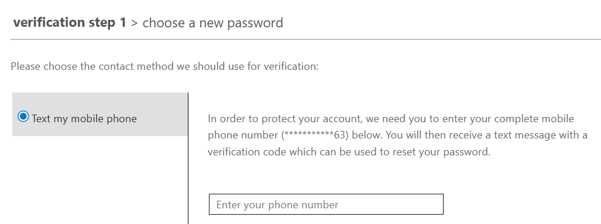
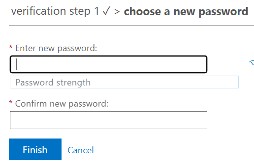

# Enterprise Identity Governance & Lifetime Automation

## Executive Summary
Phase 2 focused on transitioning the NYC Education Franchise from a Static Security Baseline to an Adaptive Identity Governance model. By leveraging Microsoft Entra ID P2 capabilities, I implemented Attribute-Based Access Control (ABAC), moved away from "All-or-Nothing" security defaults in favor of granular Conditional Access Policies (CAPs), and empowered end-users via Self-Service Password Reset (SSPR).

The result is a "Frictionless" security environment where administrative tiers are heavily guarded while standard faculty members maintain high operational velocity.

## Table of Devices
| Device Category | OS / Type | Role in Lab |
| --- | --- | --- |
| Primary Server | Ubuntu Linux | "The ""Vault"" (Identity Audit host)" |
| Mobile Endpoint | iOS / Android | MFA & Conditional Access testing |
| Workstation | macOS / Windows | Primary Staff access testing |
| Legacy Device | Older Tablet/PC | "Risk Isolation & ""Grandfathered"" Access testing" |

## 🏗️ Technical Architecture & Roadmap
*Phase 2 Objectives were executed following the successful propagation of Premium licensing.*

### 1. Automation via Dynamic Membership (ABAC)
**Objective:** Transition from manual group management to an **Attribute-Based Access Control (ABAC)** model.
* **Logic:** (`user.department -eq "Faculty"`)
* **Goal:** Automate the **Joiner-Mover-Leaver (JML)** lifecycle.
* **Result:** Identities provisioned via CSV in Phase 1 were automatically ingested into the Faculty security group based on department metadata.

> *Fig 2.1: Automation Logic— Validation of the Dynamic Membership rule processor successfully aggregating 4 faculty identities without manual intervention.*
---
### 2. Context-Aware Security (Conditional Access)
**Objective:** Replace "Security Defaults" with targeted Conditional Access Policies (CAPs) to enforce MFA based on risk and role.
**Scenarios:**
* **Geofencing:** Restrict administrative logins to known Franchise locations (e.g., NYC HQ and designated travel hubs like Cork, Ireland).
* **Device Compliance:** Require devices to be "Intune Managed" before accessing the NYC-Executives data.

| **Policy ID** | **Target Audience** | **Condition** | **Requirement** |
| --- | --- | --- | --- |
| `NYC-CAP-ADMN-MFA` | NYC-IT-Admins | All Cloud Apps | Require MFA |
| Global Mandate | All Users | Admin Portals | Require MFA |

> *Fig 2.2: Policy Architecture— Deployment of a targeted CAP requiring MFA for the administrative tier while allowing SFA for productivity endpoints.*

## 🛡️ Technical Change Log & Retrospective
### Strategic Pivot: Disabling Security Defaults
**Action:** Formally disabled Microsoft Entra "Security Defaults."
**Rationale:** Security Defaults are incompatible with granular CAPs. To implement role-based MFA, the "Training Wheels" were removed to enable the enterprise-grade **Conditional Access engine.**
**Risk Mitigation:** The `NYC-CAP-ADMN-MFA` policy was pre-staged to ensure the Global Administrator remained protected during the transition.
> ### 🔍 Technical Discovery: The "Ghost" MFA Prompt
> **Issue:** Standard users (`STAF-MCurie`) were prompted for MFA despite policy exclusions.
> **Investigation:** Analysis of **Sign-in Logs** revealed a "Global Mandate" interruption. Microsoft enforces MFA for all users when accessing the **Entra/Azure Admin Portals** (aka.ms/mfaforazure), regardless of custom policies.
> **Validation:** Confirmed custom CAP success by logging into `portal.office.com`, where the user successfully authenticated via **Single-Factor (SFA)** as intended.
---
## 🔓 Self-Service Empowerment (SSPR)
**Implementation:** Transitioned to the Converged Authentication Methods Policy to enable Self-Service Password Reset.
### SSPR Functional Validation
To ensure the "Zero-Call" support model, the password reset workflow was tested using the `STAF-MCurie ` identity.
* **The Registration Gap:** Initial testing failed due to missing user data. I remediated this by performing a registration campaign at aka.ms/ssprsetup.
* **The Challenge:** System successfully identified the "Out-of-Band" (OOB) mobile device.

> Note: For the integrity of the lab environment, the password was not rotated after successful verification to prevent session disruption.

### 3. Privileged Identity Management (PIM)
**Objective:** Implement "Just-In-Time" (JIT) access for the ADMN role.
**Rationale:** Alan Turing should not have Global Admin rights 24/7. He should "activate" them only when needed for a specific task, reducing the blast radius of a potential credential compromise.

### 4. Lifecycle Workflows
**Objective:** Automate the "Onboarding" experience.
**Logic:** Trigger an automated "Welcome to NYC Franchise" email and provision a temporary library pass as soon as a user with the STAF role is detected in the directory.

### The Plan: The "Hybrid Governance" Demonstration
To demonstrate advanced lifecycle management, I transitioned the Faculty group from a static assignment model to a dynamic membership rule based on the 'Department' attribute. This ensures that any new user provisioned with the 'Faculty' tag is automatically granted access to relevant resources, eliminating manual administrative intervention and reducing the risk of 'Access Creep'.

| Feature | Phase 1: Manual (Static) | Phase 2: Entra Suite (Dynamic) |
| --- | --- | --- |
| **Effort** | High (Manual entry for every hire) | Low (Auto-provisions based on attributes) |
| **Error Rate** | High (Human typos) | Zero (Logic-based) |
| **Security** | Static (Users stay even if fired) | Real-time (Users leave if attribute changes) |
| **Use Case** | Small Business / Specialized Roles | Enterprise / Scalable Franchises |

### Technical Change Log: Transitioning Security Baselines
**Date:** 2026-02-23
**Action:** Disabled Microsoft Entra "Security Defaults."
**Rationale:** To facilitate the implementation of granular **Conditional Access Policies (CAPs)**. Security Defaults (the baseline) is incompatible with CAPs (the enterprise standard).

**Risk Mitigation:** Before disabling the defaults, I pre-configured the `NYC-CAP-ADMN-RequireMFA` policy to ensure that no "Security Gap" occurred during the transition. Administrative identities remained protected throughout the cut-over.

**Critical Discovery: Microsoft Mandatory Portal MFA**
During UAT (User Acceptance Testing), it was observed that the STAF-MCurie identity was prompted for MFA despite being excluded from the organizational Conditional Access Policy.

**Technical Investigation:** > Analysis of the Sign-in Logs revealed that the interruption was not triggered by a custom policy, but by the Global Microsoft Admin Portal Mandate (aka.ms/mfaforazure). This mandate enforces MFA for all identities—regardless of role—when accessing administrative endpoints (entra.microsoft.com).

**Validation of Custom CAP:**
To validate the custom NYC-CAP-ADMN-RequireMFA policy, a secondary test was performed using a standard productivity endpoint (portal.office.com).
* **Result:** The standard user successfully authenticated via Single-Factor Authentication (SFA), confirming that the custom CAP is correctly excluding non-privileged users from MFA friction during standard operations, while Microsoft's global policy maintains baseline security for the portal itself.

**Self-Service Password Reset (SSPR) & Converged Policy**
**Implementation:** Transitioned from legacy SSPR settings to the Converged Authentication Methods Policy in Entra ID.
* **Enabled Methods:** Microsoft Authenticator (Push), Email OTP.
**UAT Observation (The "Registration Gap"):** > Initial testing for user STAF-MCurie resulted in a "Not Registered" error.
* **Analysis:** SSPR is a two-part system: Policy Enablement + User Registration.
* **Remediation:** In a production environment, this would be addressed via an "MFA/SSPR Registration Campaign." For this lab, registration was manually completed via the aka.ms/ssprsetup endpoint to verify the end-to-end reset workflow.

### SSPR Verification Log:
* **Status:** FUNCTIONAL / SUCCESSFUL
* **Test Path:** Triggered "Forgotten Password" workflow for STAF-MCurie.
* **Validation:** System successfully triggered an SMS OTP to the registered mobile device. Identity was verified, and the user reached the "New Password" entry portal.

> *Fig 2.1: SSPR Identity Challenge—System successfully identifying user-registered recovery methods.*

> *Fig 2.2: Out-of-Band (OOB) Verification—SMS delivery of the one-time passcode (OTP).*

> *Fig 2.3: Verification Success—System granting the password-reset write-back permission after successful authentication.*
