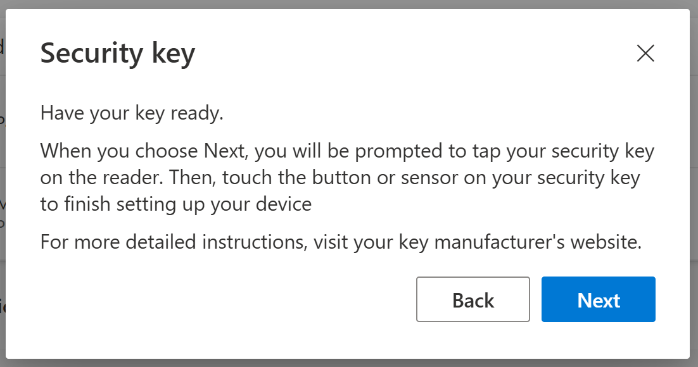
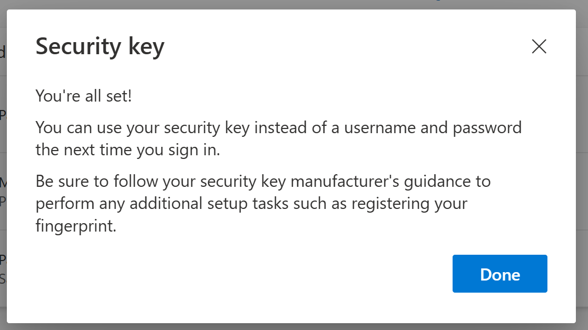
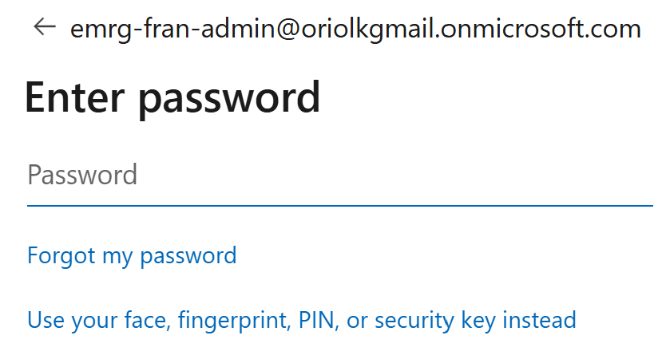
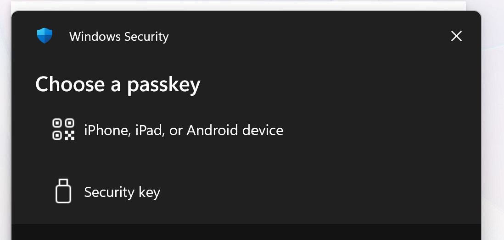
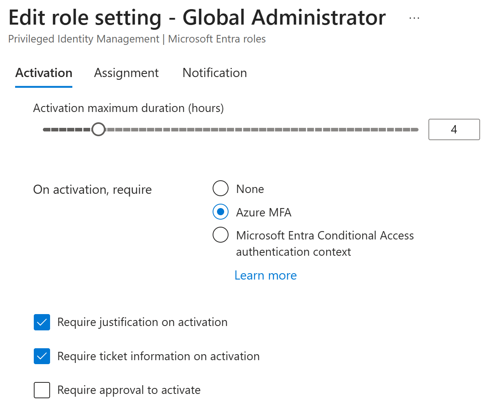
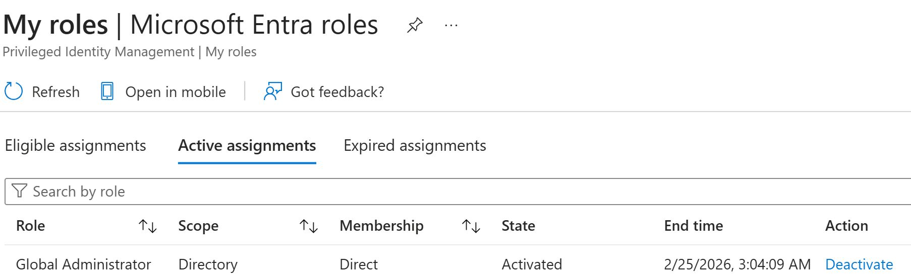
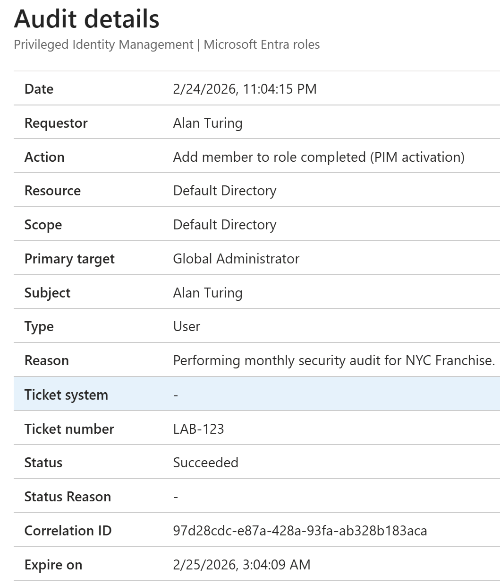

# Governance
## Phase 3: Break-Glass and PIM

### Roadmap
Step 1: The "Break-Glass" Account (Emergency Access)
Step 2: Privileged Identity Management (PIM)
Step 3: The "Legal" AUP (Terms of Use)

### Project Component: Emergency Access (Break-Glass) Strategy

1. The Rationale: Why FIDO2/Passkey?
Resilience over Redundancy: Standard MFA (Push/SMS) depends on external cloud services. If Microsoft’s MFA service or a cellular network goes down, standard admins are locked out.

Mandate Compliance: As of 2025, Microsoft mandates MFA for all admin portals. A "password-only" exclusion is no longer possible for Entra/Azure portals.

Phishing Resistance: FIDO2/Passkeys provide hardware-backed security that cannot be intercepted by AitM (Adversary-in-the-Middle) phishing attacks.

2. Configuration & Lessons Learned
Identity Isolation: Created a cloud-only account (.onmicrosoft.com) to remove dependencies on on-premises sync or custom DNS.

Policy Neutralization: Explicitly excluded the account from all Conditional Access Policies (CAPs). This ensures that a misconfigured "Block All" policy won't lock the keys inside the safe.

Technical Lesson: Learned that Incognito Mode must be disabled during Passkey registration because the browser needs a direct hardware handshake with the device's security chip.

3. Results & Verification
Zero-Standing Dependency: The account can successfully bypass standard MFA service outages.

Successful Authentication: Verified via Sign-in Logs that the account successfully authenticated using FIDO2 Security Key as the primary credential.

Security Posture: Elevated the tenant’s "Identity Secure Score" by implementing phishing-resistant factors for the most privileged roles.

Note: While the EMRG account is excluded from organizational Conditional Access MFA, it remains subject to Microsoft’s Mandatory Portal MFA (aka.ms/mfaforazure). To ensure 100% availability during a cloud service outage, I have configured this account with a Phishing-Resistant Passkey/FIDO2 method, satisfying the mandate without creating a dependency on the Entra MFA push notification service.
The "Conflict" Explained
Microsoft's Mandatory MFA Mandate (Phase 1, which started late 2024/early 2025) overrides Conditional Access for "Admin Portals."

**The Problem:** Even if you exclude EMRG-FRAN-ADMIN from your "Conditional Access" policy, when that account hits the Entra Portal, Microsoft's system-level policy says, "I don't care about your exclusions; this is a high-value portal, so give me MFA."

**The Risk:** If your primary MFA service (like the Authenticator App) is down, and Microsoft is forcing MFA on your break-glass account, you are effectively locked out.

To have a "true" Break-Glass account in 2026, you must use an MFA method that is independent of the Entra MFA service (the cloud service that sends push notifications).

Microsoft officially recommends using a FIDO2 Security Key (like a YubiKey) or Passkey for these accounts.

Why: A FIDO2 key is a "Phishing-Resistant" hardware factor.

The Benefit: It satisfies the "Mandatory MFA" requirement because the key itself provides a second factor (Physical Key + PIN), but it doesn't rely on Maria's phone, Alan's phone, or the Microsoft Authenticator cloud service being "up."

Task,Status,Note
Break-Glass User Created,Complete ✅,EMRG-FRAN-ADMIN is ready.
Passkey Registered,In Progress ⏳,"This makes the account ""Portal-Proof."""
PIM Setup,Upcoming 📅,We'll do this once the EMRG account is verified.

> *Fig 3.1: FIDO2/Passkey Initialization—Enrolling a mobile device as a hardware-backed security key for the emergency access account.*

> *Fig 3.2: Phishing-Resistant MFA—Verification of the Passkey registration, satisfying the Microsoft Mandatory MFA mandate without cloud-service dependency.*

> *Fig 3.3: Break-Glass Entry Path—The specialized authentication flow for emergency scenarios, bypassing standard password entry.*

> *Fig 3.4: Break-Glass Entry Path—The specialized authentication flow for emergency scenarios, bypassing standard password entry.*

> 🚨 Audit Note: In a production environment, this account would be connected to a Microsoft Sentinel Alert. Any login by EMRG-FRAN-ADMIN should trigger a high-severity incident notification to the CISO, as it indicates a total failure of standard administrative paths.

> *Fig 3.4: Configuring Just-In-Time (JIT) Policy—Enforcing a 4-hour limit and mandatory business justification for Global Admin elevation.*

> *Fig 3.5: Encountered a conflict where a pre-existing permanent assignment prevented PIM activation. Resolved by decommissioning the static assignment in favor of the Eligible JIT workflow.*

> *Fig*

> *Fig 3.8: PIM Audit Logs—The system-generated audit trail capturing the 'Why' behind the elevation. This ensures 100% accountability for high-privilege actions.*
