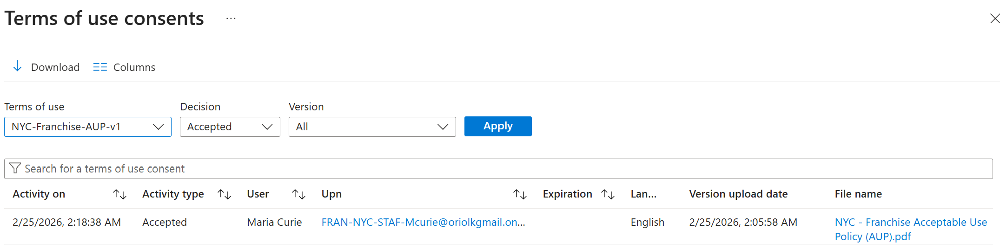
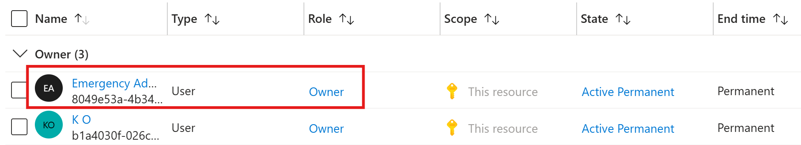
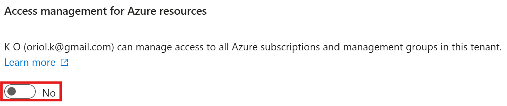
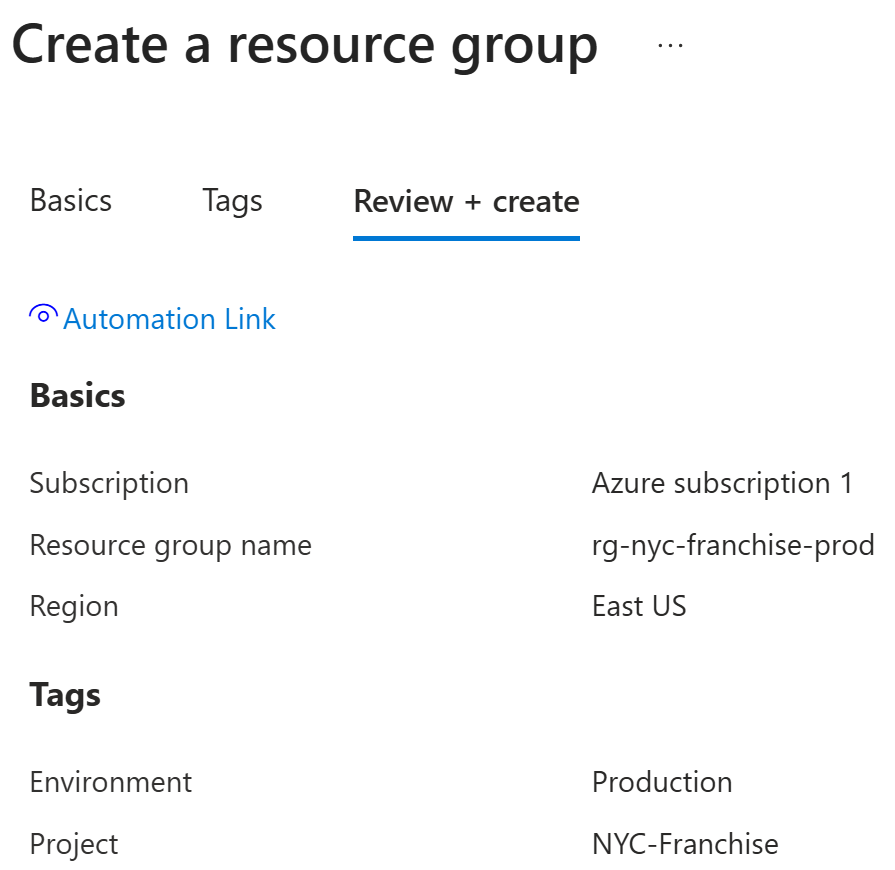
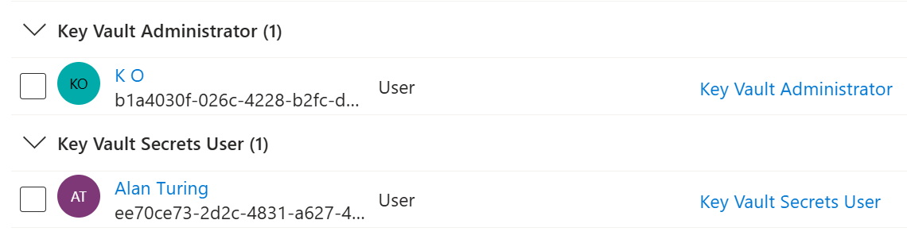
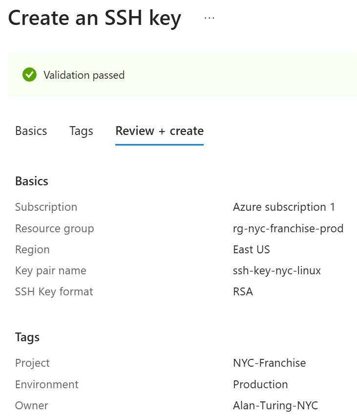
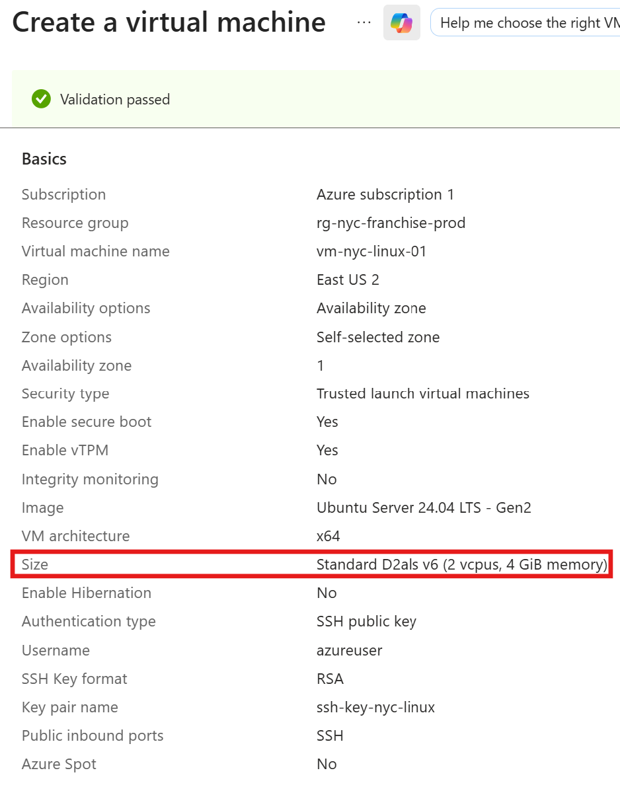
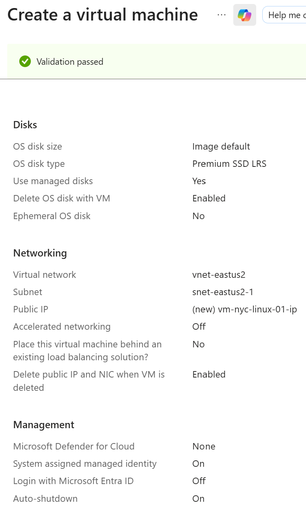
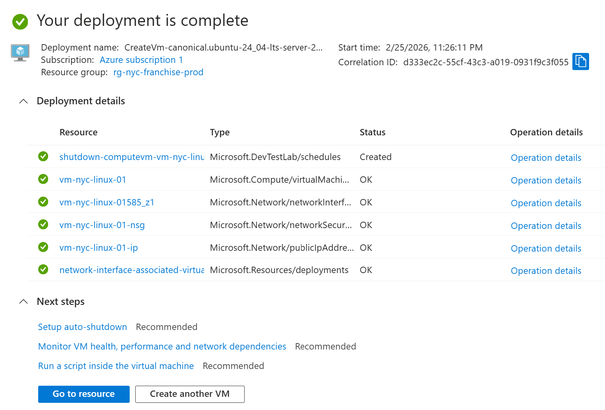

Phase 4: Infrastructure Hardening (The "Fortress")
The Task: Deploy a Linux VM (Ubuntu) in Azure.

The Security: Disable passwords. Enable Microsoft Entra ID Login for Linux.

The Governance: Apply a Conditional Access Policy that says: "To log into this specific server, you MUST be a member of 'NYC-Admins' and have an Active PIM session."

The "Wow" Factor: Using Azure Bastion (no public IP address) and Just-In-Time (JIT) VM Access.

## Making the Owner
I assigned the Owner role permanently to the Emergency Admin account. While 'Standing Access' is generally discouraged, it is a calculated risk for a break-glass account to ensure business continuity during a total identity provider (MFA/PIM) outage.

> *Fig 4.2: Elevated Access—Enabling Global Admin elevation to manage Azure Subscriptions, establishing the critical link between Identity and Resource management.*

> *Fig 4.3: Hierarchical Role Assignment—Demonstrating the distinction between Root-level elevation and Subscription-level Ownership for high-availability administration.*

> *Fig 4.5: Post-Deployment Hardening—De-elevating Global Admin root access after establishing subscription-level RBAC. This follows Zero-Trust principles by reducing the account's permanent blast radius.*

> *Fig 4.6: Resource Lifecycle Management—Establishing a dedicated Resource Group ('rg-nyc-franchise-prod') with standardized naming conventions and metadata tags for cost tracking and security governance.*

> *Fig 4.9: Security Blueprint—Final validation of the 'NYC-Franchise' Key Vault configuration, highlighting the transition to RBAC-based authorization and the enforcement of Purge Protection for data integrity.*

> *Fig 4.10: Granular Access Control—Implementing the Principle of Least Privilege by separating Vault Administration (Main Admin) from Secret Consumption (Alan Turing).*

> *Fig 4.13: IPv4 Egress Mapping—Manually resolving IPv6/IPv4 mismatches by forcing IPv4 discovery to satisfy Azure Key Vault’s legacy firewall requirements. Proves ability to troubleshoot networking barriers in a dual-stack environment.*
> *Fig 4.14: Network Hardening—Whitelisting the Administrative IPv4 address within the Key Vault firewall. This ensures the vault remains invisible to the public internet while allowing secure management from the authorized workstation.*

> *Fig 4.15: Cryptographic Governance—Final review of the 'ssh-key-nyc-linux' resource. This demonstrates the centralized management of SSH keys as independent Azure resources rather than ephemeral VM-linked objects.*

> *Fig 4.16: Infrastructure as Code (IaC) Readiness—Exporting the ARM (Azure Resource Manager) template for the SSH key resource. This provides a repeatable blueprint for automated governance and multi-region scaling.*

## Virtual Machine
Due to capacity constraints with legacy B-series hardware in East US, I pivoted to the Dals_v6 family. I managed the higher performance costs by implementing strict Auto-Shutdown policies and lifecycle management.

> *Fig 4.21: Final Deployment manifest for vm-nyc-linux-01. Successfully pivoted to D-series architecture to overcome regional capacity limits while maintaining security posture through managed SSH keys.*

> *Fig 4.22: Secure Management Configuration—Enabling System-Assigned Managed Identity for passwordless service-to-service authentication and implementing Auto-Shutdown for cost governance.*

> *Fig 4.24: Infrastructure Provisioning Success—Validation of the automated deployment of the NYC-Franchise-01 Linux server. All resources (VM, Disk, NIC, and Public IP) have transitioned to a Succeeded state.*

> *Fig 4.25: Troubleshooting SSH Handshake—Analyzing shell syntax errors during remote authentication. Identifying potential issues with character escaping or placeholder formatting.*

> *Fig 4.28: Filesystem Remediation—Identifying and resolving a shell syntax error where a private key was inadvertently renamed due to a destination path typo. Re-establishing standard SSH directory structure and key-naming conventions.*

Utilized triple-verbose SSH logging (-vvv) to identify cryptographic handshake failures and local identity-file pathing errors. Once connectivity was verified, reverted to standard log levels to optimize terminal session clarity.

> *Fig 4.29: Administrative Access Established—Final validation of the NYC-Franchise-01 production environment. SSH handshake successful via RSA-4096 key from a native Linux workstation. System is live, secure, and ready for service deployment.*

 prior to application deployment.*

 from the Instance Metadata Service (IMDS). This confirms the VM's ability to authenticate as a unique security principal within the Azure tenant.*

