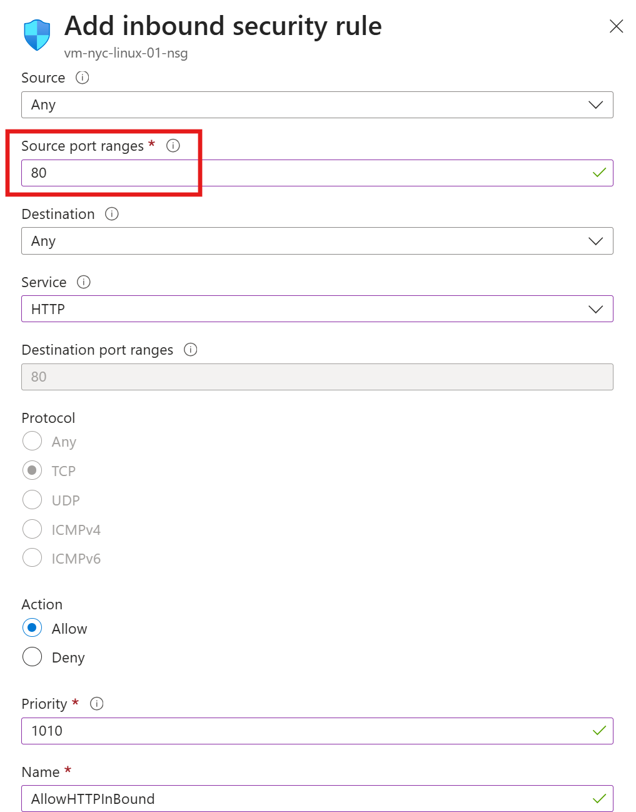

Phase 5: Defensive Operations (The "Test & Audit")
The Task: Launch a Phishing Simulation against Maria Curie.

The Incident: Maria "fails" the test. We show her account being flagged as "High Risk" in Entra Identity Protection.

The Remediation: We show how your policies automatically force her to do a Self-Service Password Reset (SSPR) to "cleanse" her risk.

The Grand Finale: A quick look at Microsoft Sentinel (SIEM) to show all these logs in one place.

> *Fig 5.1: Web Service Deployment—Successfully initialized the Nginx HTTP server on the NYC-Franchise-01 instance. The transition from a 'blank' hardened server to a functional web host is confirmed via successful HTTP response over the public internet.*

> *Fig 5.2: Inbound Traffic Regulation—Configuring the Network Security Group (NSG) to permit HTTP traffic on Port 80. This demonstrates the principle of least privilege by only opening specific ports required for the application's role as a web server.*

> *Fig 5.3: Service Availability Validation—Confirmed Nginx is listening on localhost (Port 80) and UFW rules are correctly applied. Analyzing the 'split-horizon' connectivity to ensure Azure fabric rules align with internal OS security policies.*

> *Fig 5.7: Loopback Interface Validation—Internal HTTP request to the public-facing IP returns a 200 OK status. This confirms the Nginx service is correctly bound to the public interface and identifies external network interference (ISP/Hotel Firewall) as the primary bottleneck for client-side rendering.*

> *Fig 5.9: Nginx Configuration Synthetic Testing—Validating configuration file syntax and existence of required directories. Confirming the web server is ready to bind to the network stack.*

> *Fig 5.11: Successful Public Web Service Deployment—Resolved connectivity issues by correcting the NSG Source Port range to wildcard. This allowed for the successful reception of HTTP requests from ephemeral client ports, as evidenced by the external rendering of the Nginx landing page.*
