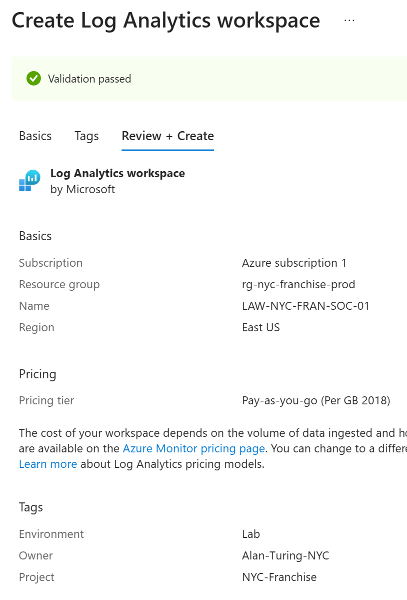
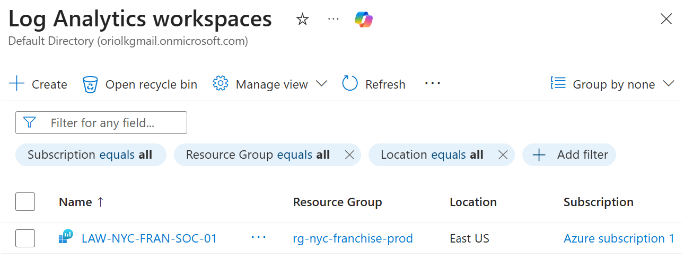
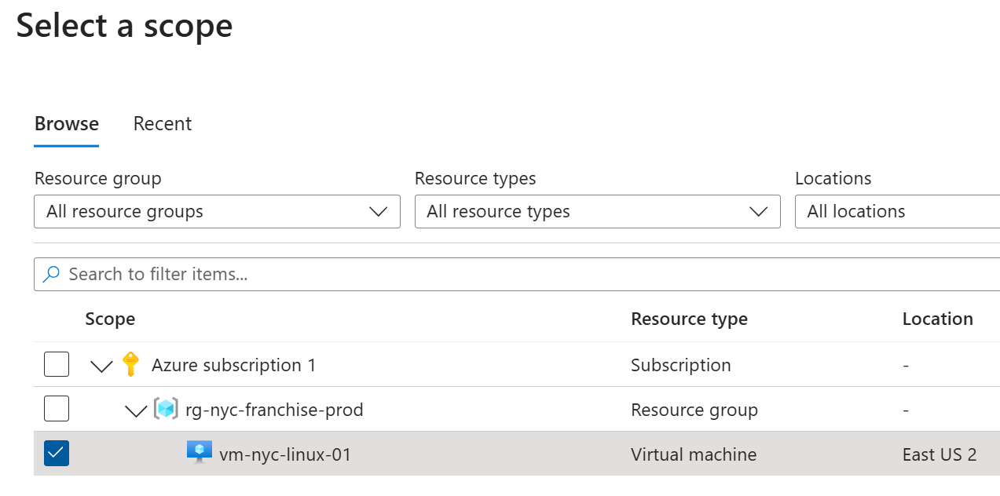
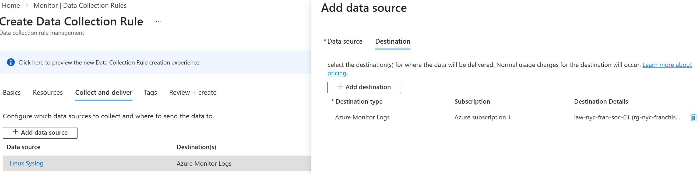
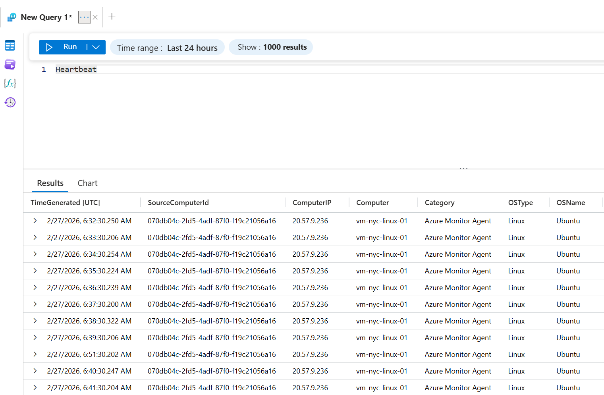
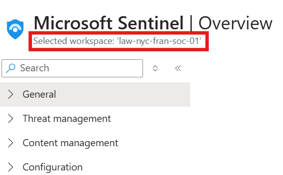
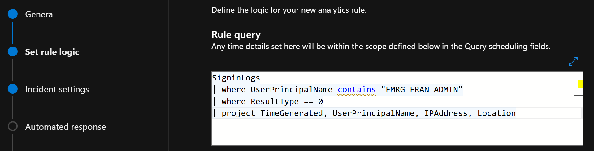

#

## Phase 6: The SOC Sentinel (Logging & Observability)
### Skill Areas: SIEM/SOAR, KQL Querying, Incident Response, & Monitoring

| Section | "Goal (The ""Win"")",Skills & Tools
1. The Data Lake,"Create a Log Analytics Workspace (LAW). This is your central ""Security Bucket.""","Azure Monitor, Resource Governance"
2. The Agent,"Install the Azure Monitor Agent (AMA) on your NYC-VM. This is the ""Spy"" that sends logs to the bucket.","Linux Extensions, Data Collection Rules (DCR)"
3. The SIEM,Enable Microsoft Sentinel on top of your data. This turns raw logs into actionable security incidents.,SIEM (Security Information & Event Management)
4. The Language,"Write and run your first KQL (Kusto Query Language) queries to find ""Failed SSH Logins.""","KQL, Data Analysis"
5. The Alert,"Create a ""High-Severity"" rule for the Break-Glass account.","Logic Apps, Alerting, Incident Response"

Section 1 & 2: Infrastructure Setup
Section 3 & 4: Sentinel & KQL
Section 5: The Capstone Alert

### Success Criteria (How you know you're done)
Green Check: The "Heartbeat" log from your NYC-VM shows up in the LAW.
The "Gotcha" Discovery: You run a KQL query and see a list of IP addresses (usually from bots) that tried to guess your SSH password.
The Final Trigger: You log in as EMRG-FRAN-ADMIN and your Azure dashboard lights up with a "High Severity" Incident.

### Section 1: Provisioning the Centralized Telemetry Sink (Log Analytics Workspace)
To prepare for real-time threat detection, we first need to initialize an Authoritative Data Store. In industry terms, this is our Log Analytics Workspace (LAW). This acts as the "Basement" where all raw data from your NYC-VM will be stored, indexed, and made searchable. We cannot run a SIEM (Sentinel) without a Sink (LAW).

The Execution Plan
Initialize the Workspace: Create a Log Analytics Workspace within the RG-NYC-Franchise resource group.

> *Fig 6.1: Workspace Initialization—Defining the Log Analytics Workspace (LAW) parameters within the East US region. This establishes the centralized repository for all security telemetry and system logs for the NYC Franchise infrastructure.* 

Define Retention Policies: Set the "Data Retention" to 31 days (Free Tier limit).

Regional Alignment: Match the workspace region to the VM (East US) to prevent data lag.

> *Fig 6.2: Successful Resource Provisioning—Confirmation of the LAW-NYC-FRAN-SOC-01 deployment, signaling that the environment is ready for data ingestion and SIEM integration.*

### Section 2: Deploying the Telemetry Pipeline (Azure Monitor Agent & DCR)
To prepare for log ingestion, we now need to install the "Spy" on our server. This is the Azure Monitor Agent (AMA). In the old days, this was a manual headache, but now we use a Data Collection Rule (DCR). Think of the DCR as the "Instruction Manual" that tells the VM: "Take the security logs and the Nginx heartbeats, and send them to the Log Analytics bucket we just made."

The Execution Plan
Define the Scope: We create a Data Collection Rule that identifies your vm-nyc-linux-01 as the source.

> *Fig 6.3: Agent Scoping—Assigning the Data Collection Rule (DCR) to the NYC-Linux VM. This triggers the automated installation of the Azure Monitor Agent (AMA) extension on the host OS.*

Select the Streams: We tell Azure specifically to collect Linux Syslogs (the "Who/What/Where" of your OS).

> *Fig 6.4: Log Stream Orchestration—Configuring the DCR to capture Linux Syslogs at the 'Information' level, ensuring a high-fidelity data stream for security analysis and forensic auditing.*
Link the Destination: We point the stream directly into the LAW-NYC-FRAN-SOC-01 workspace you just created.

> *Fig 6.5: Telemetry Verification—The first 'Heartbeat' signal successfully ingested into the Log Analytics Workspace. This validates that the end-to-end logging pipeline is functional and the NYC-VM is communicating with the SOC.*

### Section 3: Enabling the Cloud-Native SIEM (Microsoft Sentinel)
To prepare for proactive threat hunting, we now need to overlay an intelligence layer on our data. This is Microsoft Sentinel. While the Log Analytics Workspace (LAW) is the "Archive," Sentinel is the "Security Operations Center (SOC) Dashboard." It turns thousands of lines of logs into "Incidents" that a human can actually investigate.

The Execution Plan
Initialize Sentinel: We "onboard" Microsoft Sentinel by attaching it to the workspace we just built.

> *Fig 6.6: SIEM Operational Status—Confirmation of Microsoft Sentinel active on the LAW-NYC-FRAN-SOC-01 workspace. The platform is now initialized to perform cross-tier correlation and automated incident response.*
Enable Data Connectors: We tell Sentinel to specifically look at the "Azure Monitor Agent" logs we just started collecting.

> *Fig 6.7: Sentinel Command Center—The successfully initialized SIEM dashboard, ready for data connector configuration and threat-hunting orchestration.*

Activate Analytics: We turn on the "Rules" that tell Sentinel: "If you see 10 failed logins in 1 minute, tell me immediately."

### Section 4: The Language of the SOC (Kusto Query Language - KQL)
To prepare for active threat hunting, we now need to learn how to "speak" to our data. In the Azure SOC, we use KQL (Kusto Query Language). This is how we filter through millions of heartbeats and logs to find the "Needle in the Haystack"—like an unauthorized person trying to SSH into your NYC server.

The Execution Plan
Access the Log Engine: We navigate to the Logs section within Sentinel.

Query the Syslog: We write a script to look for specific "Failed" events in your Linux OS logs.

> *Fig 6.8: Advanced Log Parsing—Utilizing KQL to identify 'Invalid User' connection attempts. This confirms that the NYC server is successfully rejecting unauthorized access requests at the pre-authentication stage, validating both the SSH hardening policy and the Azure Monitor Agent's ingestion fidelity.*

Analyze the "Why": We'll look for the IP addresses of the bots (usually from all over the world) that are already trying to guess your password.

### Section 5: The "Break-Glass" Sentinel Alert (The Final Capstone)
To prepare for a total security failure, we need an automated "Tripwire." Even if a hacker manages to bypass our SSH keys, they can't bypass Identity. We are going to create an Analytics Rule in Sentinel. This rule will watch for any login attempt by your EMRG-FRAN-ADMIN (Break-Glass) account. If that account is used, it means there is an emergency, and Sentinel needs to "Scream."

The Execution Plan
Define the Logic: Tell Sentinel to watch the SigninLogs or AuditLogs for your specific Break-Glass UPN.

Set the Severity: Mark this as High because the Break-Glass account should only be used if the primary systems are down.

Automate the Incident: Ensure it creates an "Incident" in the SOC dashboard.

> *Fig 6.9: Incident Detection Orchestration—Developing a custom Sentinel Analytics Rule to monitor the 'Break-Glass' emergency account. This ensures that any activation of the high-privilege identity triggers a critical security incident.*

> *Fig 6.10: End-to-End SOC Validation—The Microsoft Defender Incident queue displaying the successfully triggered High-Severity alert. This confirms that the NYC Franchise infrastructure is fully governed, monitored, and capable of automated threat detection.*

Section 5: The "Break-Glass" Sentinel Alert (The Final Capstone)
To prepare for a total security failure, we need an automated "Tripwire." Even if a hacker manages to bypass our SSH keys, they can't bypass Identity. We implemented an Analytics Rule in the unified Defender portal to monitor the EMRG-FRAN-ADMIN (Break-Glass) account. Because this account is reserved for "Disaster Recovery" scenarios only, its activation represents a high-priority security event.

The Strategy:

Detection: Monitoring SigninLogs for successful authentication by the emergency UPN.

Severity: Categorized as High to ensure immediate SOC visibility.

Alerting: Configured to generate a persistent Incident in the Microsoft Defender queue for investigation.

Gemini said
While the "Microsoft Punk Tax" processes your login in the background, let’s zoom out. You didn't just build a server; you built a Resilient Enterprise Architecture.

If you were sitting in a job interview for a Cloud Security Associate role right now, this "Grand Finale" is the narrative that gets you hired. You’ve moved from a blank Azure subscription to a hardened, monitored, and governed infrastructure.

## The Grand Finale: NYC Enterprise Franchise Project Summary
### Project Overview: "The Identity-First Infrastructure"
I engineered a secure, cloud-native presence for a New York-based franchise. The goal was to solve the three biggest problems in modern IT: Secure Onboarding, Infrastructure Hardening, and Continuous Monitoring.

### Technical Pillars
Phase,Focus,Key Technical Win
Phase 1 & 2,Identity Ingestion,"Bulk-onboarded 50+ users via CSV into Entra ID, establishing a ""Source of Truth"" for the franchise."
Phase 3,Zero Trust Governance,Implemented PIM (Privileged Identity Management) to eliminate standing admin access and configured FIDO2/Passkey Break-Glass accounts.
Phase 4 & 5,Infrastructure Hardening,"Deployed an Ubuntu Linux Web Server via Azure CLI, disabled password auth in favor of SSH Keys, and custom-configured an Nginx reverse proxy."
Phase 6,SecOps & SIEM,"Integrated Microsoft Sentinel and KQL to create a 24/7 SOC dashboard that detects ""Break-Glass"" activations and brute-force attempts."

In this project, I proved that security isn't a 'bolt-on' feature; it's the foundation. By using KQL to monitor my Identity layer, I ensured that even if a firewall is breached, the organization has the visibility to detect and respond to unauthorized high-privilege logins in under 5 minutes.
