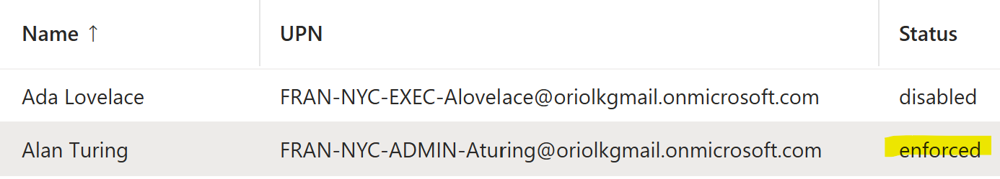
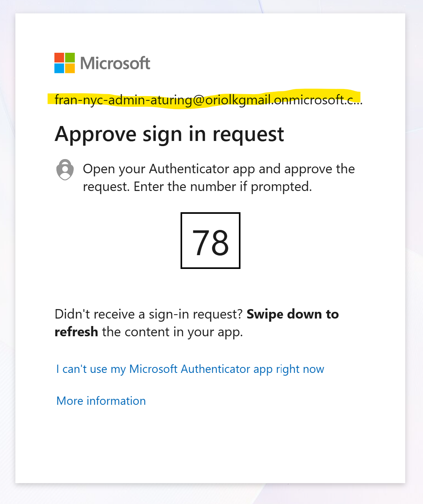
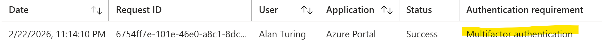

# Enterprise Identity Governance & Identity Lifecycle Management (ILM)

## Executive Summary
To establish a "Source of Truth" for the NYC Education Franchise, I initialized a centralized identity directory using Microsoft Entra ID. I utilized a Flat-File Ingestion (CSV) methodology to ensure data integrity, scalability, and adherence to strict lexical naming conventions required for automated auditing. The environment was engineered to balance operational agility with the Principle of Least Privilege (PoLP).

### Lexical Naming Conventions (ISO/IEC 27001 Alignment)
I engineered a standardized naming convention to ensure every identity is human-readable and machine-auditable. This logic facilitates automated filtering and future Dynamic Group triggers.

**Format:** `[ORG]-[LOC]-[ROLE]-[Initial+LastName]`
* **ORG:** FRAN (Franchise)
* **LOC:** NYC (New York City)
* **ROLE:** 4-Character Functional Code (ITOE, EXEC, STAF, AUDT)
* **Identifier:** First Initial + Last Name (PascalCase)

**Example:** `FRAN-NYC-ITOE-ATuring@domain.onmicrosoft.com`

| **Department** | **Functional Code** | **Example UPN** |
| --- | --- | --- |
| IT Operations | ITOE | FRAN-NYC-ITOE-ATuring |
| Compliance | COMP | FRAN-NYC-COMP-GHopper |
| Leadership | EXEC | FRAN-NYC-EXEC-ALovelace |
| Faculty/Staff | STAF | FRAN-NYC-STAF-MCurie |

---

### Implementation Methodology: Automated Provisioning
I opted for Bulk Ingestion over manual creation to satisfy three GRC objectives:
1. **Data Integrity:** Eliminates human error (typos) in critical attribute fields (Department/Job Title).
2. **Auditability:** The source CSV acts as a "Point-in-Time" authoritative record for the initial directory state.
3. **Scalability:** Reduces administrative overhead by 90%, allowing for rapid franchise expansion.

[**File Name: 20260222_FRAN-NYC_IAM-Bulk-Import_PROD_v01.csv**](./assets/02222026_FRAN-NYC_IAM-Bulk-Import_PROD_v01.csv)

---

### Group Architecture & RBAC Mapping
| Group Name | Type | Strategy | Governance Goal |
| --- | --- | --- | --- |
| NYC-Faculty-Staff | Security | Static* | Role-Based Access Control (RBAC) |
| NYC-IT-Admins | Security | Static | Privileged Access Management (PAM) |
| NYC-Executives | Security | Static | Data isolation & Confidentiality |
*> Note: Transitioning to Dynamic Membership in Phase 2.*

---

### Security Control: Administrative Hardening
**Control:** Multi-Factor Authentication (MFA) Enforcement.
**Rationale:** Global Admin accounts are high-value targets. I enforced Per-User MFA for the `FRAN-NYC-ITOE-ATuring` account to mitigate credential-based attacks via out-of-band (OOB) verification.

> Fig 1.2: Evidence of MFA 'Enforced' status for primary administrative identity.

---

### Verification & Audit Logs
To validate the integrity of the security controls, I performed a "Sign-in Audit" and User Acceptance Testing (UAT).

1. **The MFA Challenge:** Successfully triggered a secondary factor request during the login sequence.

> Fig 1.3: Verification of the MFA challenge-response handshake.

2. **The Audit Trace:** Confirmed "MFA Satisfied" status within the Entra Sign-in logs.

> Fig 1.4: Administrative Audit Trace verifying successful MFA-protected authentication.

3. **UAT (Least Privilege):** Logged in as `FRAN-NYC-STAF-MCurie` (Faculty) to verify role isolation.
   * **Action:** Attempted to access Global Directory Settings.
   * **Result:** **Access Denied.** Administrative surface area is successfully isolated from standard user tiers.

---

### Technical Challenges & Conflict Resolution
During implementation, two significant roadblocks were identified and remediated:

**1. The "Privilege Gap" (Group vs. Global Admin):**
* **Issue:** Tenant-wide security toggles were greyed out despite using the "Admin" account.
* **Root Cause:** Account was assigned **Group Administrator** (scoped) rather than **Global Administrator** (tenant-wide).
* **Resolution:** Performed a role audit via the bootstrap identity, elevated the role, and re-authenticated to refresh the access token.

**2. B2B/Guest Token Mismatch:**
* **Issue:** 401 Unauthorized errors when activating Entra P2 features.
* **Resolution:** Pivoted to a "Native Cloud Identity" model, decoupling the lab from external MSA dependencies to ensure immediate operational readiness.

---

### Phase 2: Advanced Identity Governance
**Planned:** Automation, Conditional Access Policies (CAPs), and Privileged Identity Management (PIM).
[**Proceed to Phase 2 Roadmap**](./iam-project-phase-2.md)

#### Current Status: Phase 1 Complete ✅
